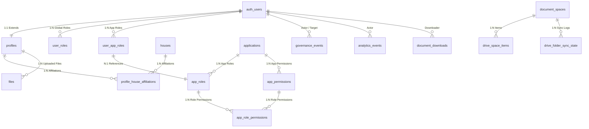

# Sakura 3 Residential Ecosystem — Database Structure Reference

This document is the canonical reference for the database schema, Row Level Security (RLS) policies, triggers, and functions running on **Supabase (PostgreSQL)**. The database is shared across all ecosystem applications (`community-portal`, `community-docs`, `rekap-viewer`, and `file-finder-sr3`).

---

## 1. Entity Relationship Diagram



---

## 2. Global Custom Types & Enums

### `public.app_role` (Global Platform Roles)
Used in `public.user_roles` to define global permissions bypassing app-level RLS constraints.
* Values:
  * `admin` — Full platform administrator.
  * `user` — Baseline authenticated user.
  * `resident_verifier` — Management role; can approve/reject resident applications.
  * `platform_moderator` — Moderation role; can log governance actions.
  * `committee` — Committee member role.

### `public.approval_status` (Resident Approval State)
Used in `public.profiles` to track onboarding and registration validation.
* Values:
  * `unsubmitted` — Initial sign-up state, profile forms not yet submitted.
  * `pending` — Submitted and awaiting verifier validation.
  * `approved` — Verified resident; triggers automatic access configuration.
  * `suspended` — Access temporarily revoked.
  * `rejected` — Registration denied.

### `public.user_permission` (Legacy Permissions)
Kept for legacy compatibility for apps pre-dating the App-RBAC implementation.
* Values:
  * `read_files`
  * `upload_files`

---

## 3. Core Tables Reference

### 3.1. `public.profiles`
Extends `auth.users` with community-specific metadata and verification states.

| Column | Type | Nullable | Default | Constraints & Description |
| :--- | :--- | :--- | :--- | :--- |
| `id` | `UUID` | No | *None* | **PRIMARY KEY**, references `auth.users(id)` ON DELETE CASCADE |
| `email` | `TEXT` | Yes | *None* | Email address of the resident. |
| `full_name` | `TEXT` | Yes | *None* | Full name, extracted from Google OAuth metadata. |
| `avatar_url` | `TEXT` | Yes | *None* | User profile avatar link. |
| `house_number` | `VARCHAR(25)` | Yes | `NULL` | Deprecated/Legacy field. Primary house identifier. |
| `whatsapp_number`| `VARCHAR(25)` | Yes | `NULL` | WhatsApp contact details. |
| `approval_status`| `public.approval_status` | No | `'unsubmitted'` | Registration phase tracking. Constraint: `check_approval_status` CHECK IN (`unsubmitted`, `pending`, `approved`, `suspended`, `rejected`). |
| `participant_type`| `TEXT` | Yes | `'resident'` | Onboarding category: `'resident'` or `'non_resident'`. |
| `resident_subtype`| `TEXT` | Yes | *None* | Onboarding sub-classification: `'owner'`, `'renter'`, `'household_member'`, `'caretaker'`. |
| `requested_affiliation` | `TEXT` | Yes | *None* | For non-residents: `'secretariat'`, `'security'`, `'vendor'`, `'assistant'`. |
| `last_active_at` | `TIMESTAMPTZ` | Yes | *None* | Operational telemetry tracking last api request. |
| `created_at` | `TIMESTAMPTZ` | No | `now()` | Audit timestamp. |
| `updated_at` | `TIMESTAMPTZ` | No | `now()` | Audit timestamp. |

#### Triggers & Functions:
* **`update_profiles_updated_at`** (BEFORE UPDATE): Calls `update_updated_at_column()` to synchronize `updated_at`.
* **`on_profile_created_assign_admin`** (AFTER INSERT): Calls `assign_admin_role()` to promote `sakura3.programming@gmail.com` to global admin.
* **`on_profile_approved_assign_resident_roles`** (AFTER UPDATE OF `approval_status`): Calls `handle_resident_approval()` to auto-assign default App-RBAC resident roles on approval.

#### Row Level Security (RLS):
* **"Users can view all profiles"** (SELECT): Allowed to `true` (any authenticated or public request).
* **"Users can update own profile"** (UPDATE): Allowed if `auth.uid() = id`.
* **"Platform managers can update all profiles"** (UPDATE): Allowed if `public.is_platform_manager(auth.uid())` resolves to `true`.

---

### 3.2. `public.user_roles`
Binds global platform privileges (e.g. administrator or verifier) to users.

| Column | Type | Nullable | Default | Constraints & Description |
| :--- | :--- | :--- | :--- | :--- |
| `id` | `UUID` | No | `gen_random_uuid()` | **PRIMARY KEY** |
| `user_id` | `UUID` | No | *None* | References `auth.users(id)` ON DELETE CASCADE. |
| `role` | `public.app_role` | No | *None* | Global role variant. |
| `created_at` | `TIMESTAMPTZ` | No | `now()` | Audit timestamp. |

* Constraints: `UNIQUE (user_id, role)`

#### Row Level Security (RLS):
* **"Admins can view all roles"** (SELECT): Allowed if calling user holds `admin` global role.
* **"Admins can manage roles"** (ALL): Allowed if calling user holds `admin` global role.

---

### 3.3. `public.files`
Operational storage registry for uploaded documents (e.g. Bank Statements and CSVs).

| Column | Type | Nullable | Default | Constraints & Description |
| :--- | :--- | :--- | :--- | :--- |
| `id` | `UUID` | No | `gen_random_uuid()` | **PRIMARY KEY** |
| `name` | `TEXT` | No | *None* | Display name of the file. |
| `storage_path` | `TEXT` | No | *None* | Bucket location under Supabase storage. |
| `content` | `TEXT` | Yes | *None* | Extracted textual content (used for full-text search indexing). |
| `uploader_id` | `UUID` | No | *None* | References `public.profiles(id)` ON DELETE CASCADE. |
| `file_size` | `INTEGER` | Yes | *None* | Size of the object in bytes. |
| `mime_type` | `TEXT` | Yes | `'text/plain'` | Object MIME classification. |
| `created_at` | `TIMESTAMPTZ` | No | `now()` | Audit timestamp. |
| `updated_at` | `TIMESTAMPTZ` | No | `now()` | Audit timestamp. |

#### Indexes:
* `idx_files_content_search` (GIN on GIN-compatible english search vector of `content`).
* `idx_files_name_search` (GIN on GIN-compatible english search vector of `name`).

#### Triggers & Functions:
* **`update_files_updated_at`** (BEFORE UPDATE): Calls `update_updated_at_column()` to sync `updated_at`.

#### Row Level Security (RLS):
* **"Approved users can view files"** (SELECT): Allowed if `public.has_namespaced_permission(auth.uid(), 'ipl_finder.read_files')` resolves to `true`.
* **"Users with upload permission can upload files"** (INSERT): Allowed if `auth.uid() = uploader_id` AND `public.has_namespaced_permission(auth.uid(), 'ipl_finder.upload_files')`.
* **"Users can delete own files"** (DELETE): Allowed if `auth.uid() = uploader_id` AND `public.has_namespaced_permission(auth.uid(), 'ipl_finder.upload_files')`.

---

## 4. App-RBAC Namespaced Access System

### 4.1. `public.applications`
Ecosystem applications registry defining permission namespaces.

| Column | Type | Nullable | Default | Constraints & Description |
| :--- | :--- | :--- | :--- | :--- |
| `id` | `UUID` | No | `gen_random_uuid()` | **PRIMARY KEY** |
| `slug` | `TEXT` | No | *None* | **UNIQUE**. Namespace prefix (e.g. `'ipl_finder'`, `'rekap_viewer'`, `'documents'`). |
| `name` | `TEXT` | No | *None* | Display name of the application. |
| `description`| `TEXT` | Yes | *None* | Purpose of the app. |
| `url` | `TEXT` | Yes | *None* | Target redirect origin destination. |
| `created_at` | `TIMESTAMPTZ` | No | `now()` | Audit timestamp. |

#### Row Level Security (RLS):
* **"Approved residents can view connected apps and roles"** (SELECT): Allowed if calling user holds `approved` status in `public.profiles`.
* **"Platform managers can manage application registry"** (ALL): Restricted to users with the `admin` global role.

---

### 4.2. `public.app_permissions`
Granular app permissions defined within the app's slug namespace.

| Column | Type | Nullable | Default | Constraints & Description |
| :--- | :--- | :--- | :--- | :--- |
| `id` | `UUID` | No | `gen_random_uuid()` | **PRIMARY KEY** |
| `app_id` | `UUID` | No | *None* | References `public.applications(id)` ON DELETE CASCADE. |
| `name` | `TEXT` | No | *None* | Action keyword (e.g. `'read_files'`, `'upload_files'`, `'finance'`). |
| `description`| `TEXT` | Yes | *None* | Description of what capability is enabled. |

* Constraints: `UNIQUE (app_id, name)`

#### Row Level Security (RLS):
* **"Approved residents can view app capabilities"** (SELECT): Allowed if calling user's status is `approved`.

---

### 4.3. `public.app_roles`
Ecosystem app roles which act as templates binding capabilities.

| Column | Type | Nullable | Default | Constraints & Description |
| :--- | :--- | :--- | :--- | :--- |
| `id` | `UUID` | No | `gen_random_uuid()` | **PRIMARY KEY** |
| `app_id` | `UUID` | No | *None* | References `public.applications(id)` ON DELETE CASCADE. |
| `name` | `TEXT` | No | *None* | Role key (e.g. `'resident'`, `'admin'`, `'finance'`). |
| `description`| `TEXT` | Yes | *None* | Scope description. |

* Constraints: `UNIQUE (app_id, name)`

#### Row Level Security (RLS):
* **"Approved residents can view role templates"** (SELECT): Allowed if calling user's status is `approved`.

---

### 4.4. `public.app_role_permissions`
Defines the mapping between roles and permission nodes.

| Column | Type | Nullable | Default | Constraints & Description |
| :--- | :--- | :--- | :--- | :--- |
| `id` | `UUID` | No | `gen_random_uuid()` | **PRIMARY KEY** |
| `app_role_id` | `UUID` | No | *None* | References `public.app_roles(id)` ON DELETE CASCADE. |
| `permission_id`| `UUID` | No | *None* | References `public.app_permissions(id)` ON DELETE CASCADE. |

* Constraints: `UNIQUE (app_role_id, permission_id)`

#### Row Level Security (RLS):
* **"Approved residents can view role bindings"** (SELECT): Allowed if calling user's status is `approved`.

---

### 4.5. `public.user_app_roles`
User-level bindings to application roles.

| Column | Type | Nullable | Default | Constraints & Description |
| :--- | :--- | :--- | :--- | :--- |
| `id` | `UUID` | No | `gen_random_uuid()` | **PRIMARY KEY** |
| `user_id` | `UUID` | No | *None* | References `auth.users(id)` ON DELETE CASCADE. |
| `app_role_id` | `UUID` | No | *None* | References `public.app_roles(id)` ON DELETE CASCADE. |
| `granted_by` | `UUID` | Yes | *None* | References `auth.users(id)` ON DELETE SET NULL. |
| `created_at` | `TIMESTAMPTZ` | No | `now()` | Audit timestamp. |

* Constraints: `UNIQUE (user_id, app_role_id)`

#### Triggers & Functions:
* **`sync_legacy_permissions_trg`** (AFTER INSERT OR UPDATE OR DELETE): Calls `sync_legacy_permissions()` to project effective `ipl_finder` permissions to `public.user_permissions` table.
* **`log_user_app_role_governance_trg`** (AFTER INSERT OR DELETE): Calls `log_user_app_role_governance()` to log role assignment audits in `governance_events`.

#### Row Level Security (RLS):
* **"Approved residents can view active app access mappings"** (SELECT): Allowed if calling user's status is `approved`.
* **"Platform managers can manage resident app role mappings"** (ALL): Allowed if caller holds global role `admin` or `resident_verifier`.

---

## 5. Housing Master & Affiliation Registry

### 5.1. `public.houses`
Static lookup table containing master house numbers.

| Column | Type | Nullable | Default | Constraints & Description |
| :--- | :--- | :--- | :--- | :--- |
| `id` | `UUID` | No | `gen_random_uuid()` | **PRIMARY KEY** |
| `house_number`| `TEXT` | No | *None* | **UNIQUE**. Textual identification block (e.g. `'D1'`, `'E2'`). |
| `created_at` | `TIMESTAMPTZ` | No | `now()` | Audit timestamp. |

#### Row Level Security (RLS):
* **"Allow public read access to houses"** (SELECT): Allowed (public read access).

---

### 5.2. `public.profile_house_affiliations`
Defines the many-to-many relationship between profiles and houses with specific role relationships.

| Column | Type | Nullable | Default | Constraints & Description |
| :--- | :--- | :--- | :--- | :--- |
| `id` | `UUID` | No | `gen_random_uuid()` | **PRIMARY KEY** |
| `profile_id` | `UUID` | No | *None* | References `public.profiles(id)` ON DELETE CASCADE. |
| `house_id` | `UUID` | No | *None* | References `public.houses(id)` ON DELETE CASCADE. |
| `affiliation_type`| `VARCHAR(30)` | No | *None* | Role type. Constraint: CHECK IN (`'owner'`, `'renter'`, `'household_member'`, `'caretaker'`). |
| `is_primary` | `BOOLEAN` | No | `false` | Marks primary residence. Guaranteed unique per profile. |
| `start_date` | `DATE` | Yes | *None* | Historical timeframe bounds. |
| `end_date` | `DATE` | Yes | *None* | Historical timeframe bounds. |
| `created_at` | `TIMESTAMPTZ` | No | `now()` | Audit timestamp. |

* Constraints: `UNIQUE (profile_id, house_id, affiliation_type)`

#### Indexes:
* `idx_profile_house_affiliations_profile` on `(profile_id)`.
* `idx_profile_house_affiliations_house` on `(house_id)`.
* `unique_primary_affiliation_per_profile` (**UNIQUE FILTERED INDEX**): `(profile_id) WHERE (is_primary = true)` guarantees at most one active primary affiliation per profile.

#### Row Level Security (RLS):
* **"Users can view all affiliations"** (SELECT): Allowed to all authenticated users (`auth.uid() IS NOT NULL`).
* **"Platform managers can manage all affiliations"** (ALL): Allowed if caller holds global role `admin` or `resident_verifier`.

---

## 6. Audit Logs, Governance, & Telemetry

### 6.1. `public.governance_events`
Immutable ledger of actions performed by system administrators and platform moderators.

| Column | Type | Nullable | Default | Constraints & Description |
| :--- | :--- | :--- | :--- | :--- |
| `id` | `UUID` | No | `gen_random_uuid()` | **PRIMARY KEY** |
| `actor_user_id` | `UUID` | Yes | *None* | References `auth.users(id)` ON DELETE SET NULL. Who triggered the action. |
| `target_user_id`| `UUID` | Yes | *None* | References `auth.users(id)` ON DELETE SET NULL. Target recipient user. |
| `action` | `TEXT` | No | *None* | Operational keyword (e.g. `'assigned_app_role'`, `'revoked_app_role'`). |
| `reason` | `TEXT` | Yes | *None* | Human readable description of action justification. |
| `metadata` | `JSONB` | Yes | `'{}'::jsonb` | Context values (e.g. specific application slugs, trigger sources). |
| `created_at` | `TIMESTAMPTZ` | No | `now()` | Event trigger timestamp. |

#### Row Level Security (RLS):
* **"Admins and verifiers can view governance events"** (SELECT): Allowed if caller holds global role `admin` or `resident_verifier`.
* **"Authorized system and managers can create governance events"** (INSERT): Allowed if caller holds global role `admin`, `resident_verifier`, or `platform_moderator`.

---

### 6.2. `public.activity_logs`
Generic action logs for audit trails.

| Column | Type | Nullable | Default | Constraints & Description |
| :--- | :--- | :--- | :--- | :--- |
| `id` | `UUID` | No | `gen_random_uuid()` | **PRIMARY KEY** |
| `user_id` | `UUID` | No | *None* | Actor UUID. |
| `action` | `TEXT` | No | *None* | Logged activity action. |
| `resource_type` | `TEXT` | No | *None* | e.g. `'file'`, `'profile'`. |
| `resource_id` | `UUID` | Yes | *None* | UUID identifier of modified resource. |
| `resource_name` | `TEXT` | Yes | *None* | Human readable identification. |
| `metadata` | `JSONB` | Yes | `'{}'::jsonb` | Extensible JSON container. |
| `created_at` | `TIMESTAMPTZ` | No | `now()` | Log timestamp. |

#### Indexes:
* `idx_activity_logs_created_at` on `(created_at DESC)`.
* `idx_activity_logs_action` on `(action)`.

#### Row Level Security (RLS):
* **"Admins can view all activity logs"** (SELECT): Allowed if caller holds global role `admin`.
* **"Users can insert own activity"** (INSERT): Allowed if `auth.uid() = user_id`.

---

### 6.3. `public.analytics_events`
General telemetry tracking user behaviour across portal landing pages and child integrations.

| Column | Type | Nullable | Default | Constraints & Description |
| :--- | :--- | :--- | :--- | :--- |
| `id` | `UUID` | No | `gen_random_uuid()` | **PRIMARY KEY** |
| `user_id` | `UUID` | Yes | *None* | References `auth.users(id)` ON DELETE SET NULL. |
| `app_slug` | `TEXT` | No | *None* | Application origin tracking keyword. |
| `event_name` | `TEXT` | No | *None* | Analytics action key name. |
| `properties` | `JSONB` | No | `'{}'::jsonb` | Context details dictionary. |
| `created_at` | `TIMESTAMPTZ` | No | `now()` | Trigger timestamp. |

#### Indexes:
* `idx_analytics_events_created_at` on `(created_at DESC)`.
* `idx_analytics_events_app_slug` on `(app_slug)`.
* `idx_analytics_events_event_name` on `(event_name)`.
* `idx_analytics_events_user_id` on `(user_id)`.

#### Row Level Security (RLS):
* **"Users can insert own analytics"** (INSERT): Allowed if `auth.uid() = user_id`.
* **"Admins can view all analytics events"** (SELECT): Allowed if caller holds global role `admin`.

---

## 7. Document Indexing System (`community-docs`)

### 7.1. `public.document_spaces`
Google Drive namespaces folders indexed to serve community documents.

| Column | Type | Nullable | Default | Constraints & Description |
| :--- | :--- | :--- | :--- | :--- |
| `id` | `UUID` | No | `gen_random_uuid()` | **PRIMARY KEY** |
| `name` | `TEXT` | No | *None* | Display title. |
| `slug` | `TEXT` | No | *None* | **UNIQUE**. URL slug identification. |
| `description`| `TEXT` | Yes | *None* | Details on workspace items. |
| `drive_folder_id` | `TEXT` | No | *None* | Associated Google Drive Folder Identifier. |
| `is_visible` | `BOOLEAN` | No | `true` | Visibility flag. |
| `display_order` | `INTEGER` | No | `0` | Sequence ordering positioning. |
| `created_at` | `TIMESTAMPTZ` | No | `now()` | Audit timestamp. |
| `updated_at` | `TIMESTAMPTZ` | No | `now()` | Audit timestamp. |
| `updated_by` | `UUID` | Yes | *None* | References `auth.users(id)` ON DELETE SET NULL. |
| `access_rules` | `JSONB` | Yes | `'{}'::jsonb` | Dynamic permissions definitions schema. |

#### Row Level Security (RLS):
* **"Anyone can view visible spaces"** (SELECT): Allowed if `is_visible = true`.
* **"Admins can manage spaces"** (ALL): Allowed if caller holds global role `admin`.

---

### 7.2. `public.drive_space_items`
Cached Google Drive files and folder hierarchies inside defined namespaces.

| Column | Type | Nullable | Default | Constraints & Description |
| :--- | :--- | :--- | :--- | :--- |
| `id` | `UUID` | No | `gen_random_uuid()` | **PRIMARY KEY** |
| `space_id` | `UUID` | No | *None* | References `public.document_spaces(id)` ON DELETE CASCADE. |
| `drive_file_id` | `TEXT` | No | *None* | Identifier on Google Drive. |
| `name` | `TEXT` | No | *None* | File name. |
| `mime_type` | `TEXT` | No | *None* | Drive object MIME class. |
| `size` | `BIGINT` | Yes | *None* | Size of the object in bytes. |
| `modified_time` | `TIMESTAMPTZ` | Yes | *None* | Last modified metadata from Drive. |
| `thumbnail_link` | `TEXT` | Yes | *None* | Thumbnail url. |
| `web_view_link` | `TEXT` | Yes | *None* | Target redirect origin destination. |
| `parent_drive_id` | `TEXT` | Yes | *None* | Parent folder identification. |
| `is_folder` | `BOOLEAN` | Yes | `false` | Folders structural marker. |
| `is_shortcut`| `BOOLEAN` | Yes | `false` | Shortcut pointer marker. |
| `shortcut_target_id` | `TEXT` | Yes | *None* | Target pointing address. |
| `is_synthetic_target` | `BOOLEAN` | Yes | `false` | Synthetic folder marker. |
| `breadcrumb` | `JSONB` | Yes | *None* | Hierarchical parent tracking array. |
| `sync_run_id`| `TEXT` | Yes | *None* | Sync job identifier mapping. |
| `indexed_at` | `TIMESTAMPTZ` | Yes | `now()` | Cache index update timestamp. |

* Constraints: `CONSTRAINT unique_space_drive_file UNIQUE (space_id, drive_file_id)`

#### Indexes:
* `idx_drive_space_items_space` on `(space_id)`.
* `idx_drive_space_items_file` on `(drive_file_id)`.
* `idx_drive_space_items_target` on `(shortcut_target_id)`.
* `idx_drive_space_items_parent` on `(parent_drive_id)`.
* `idx_drive_space_items_sync_run` on `(sync_run_id)`.
* `idx_drive_space_items_synthetic` on `(is_synthetic_target)`.

#### Row Level Security (RLS):
* **"Public or authenticated read access for drive_space_items"** (SELECT): Allowed to all users (`true`).
* **"Allow backend write access for drive_space_items"** (ALL): Permissive logic (`true` USING & WITH CHECK) for automated backend indexers.

---

### 7.3. `public.drive_folder_sync_state`
Sync execution logs detailing indexing routines for community documents.

| Column | Type | Nullable | Default | Constraints & Description |
| :--- | :--- | :--- | :--- | :--- |
| `id` | `UUID` | No | `gen_random_uuid()` | **PRIMARY KEY** |
| `space_id` | `UUID` | No | *None* | References `public.document_spaces(id)` ON DELETE CASCADE. |
| `folder_id` | `TEXT` | No | *None* | Drive ID of folder target sync. |
| `last_synced_at`| `TIMESTAMPTZ` | No | `now()` | Execution log timestamp. |
| `items_synced` | `INTEGER` | Yes | `0` | Number of files indexed during run. |
| `deleted_stale_rows` | `INTEGER` | Yes | `0` | Quantity of stale records purged. |
| `duration_ms`| `INTEGER` | Yes | *None* | Job completion time duration. |
| `status` | `TEXT` | Yes | `'success'` | Operational result classification. |

* Constraints: `CONSTRAINT unique_space_folder_sync UNIQUE (space_id, folder_id)`

#### Indexes:
* `idx_folder_sync_state` on `(space_id, folder_id)`.

#### Row Level Security (RLS):
* **"Public or authenticated read access for drive_folder_sync_state"** (SELECT): Allowed to all (`true`).
* **"Allow backend write access for drive_folder_sync_state"** (ALL): Permissive write checks (`true`) for background sync handlers.

---

### 7.4. `public.document_downloads`
User download activity logging for security tracking.

| Column | Type | Nullable | Default | Constraints & Description |
| :--- | :--- | :--- | :--- | :--- |
| `id` | `UUID` | No | `gen_random_uuid()` | **PRIMARY KEY** |
| `user_id` | `UUID` | Yes | *None* | References `auth.users(id)` ON DELETE SET NULL. |
| `drive_file_id` | `TEXT` | No | *None* | Google Drive File ID. |
| `file_name` | `TEXT` | Yes | *None* | Downloaded file name. |
| `downloaded_at` | `TIMESTAMPTZ` | No | `now()` | Execution timestamp. |
| `watermark_id`| `TEXT` | Yes | *None* | PDF Watermark identifier tracking. |
| `ip_address` | `TEXT` | Yes | *None* | Request source IP. |
| `user_agent` | `TEXT` | Yes | *None* | HTTP User-Agent. |
| `activity_type` | `TEXT` | No | `'DOWNLOAD'` | Category of transaction (`'DOWNLOAD'`, `'VIEW'`). |

#### Row Level Security (RLS):
* **"Anyone can create download logs"** (INSERT): Allowed to all (`true` WITH CHECK).
* **"Admins can view download logs"** (SELECT): Allowed if caller holds global role `admin`.

---

## 8. Database Functions & Logic Reference

### 8.1. Platform Managers Check helper
`public.is_platform_manager(uid UUID) RETURNS BOOLEAN`
* **Type**: `SECURITY DEFINER`, `STABLE`
* **Description**: Returns `true` if target user holds `admin` or `resident_verifier` roles. Excludes `platform_moderator` role for security isolation during onboarding validation updates.
* **SQL Implementation**:
  ```sql
  SELECT EXISTS (
    SELECT 1
    FROM public.user_roles
    WHERE user_id = uid
      AND role IN ('admin', 'resident_verifier')
  );
  ```

### 8.2. Namespaced Permission helper
`public.has_namespaced_permission(user_id UUID, namespaced_perm TEXT) RETURNS BOOLEAN`
* **Type**: `SECURITY DEFINER`
* **Description**: Core dynamic permission resolver. Always returns `true` for global `admin` roles, or checks if target user holds an app role that is bound to the namespace permission (e.g. `'ipl_finder.read_files'`).
* **SQL Implementation**:
  ```sql
  -- Global Admin check
  IF EXISTS (SELECT 1 FROM public.user_roles ur WHERE ur.user_id = $1 AND ur.role = 'admin') THEN
    RETURN TRUE;
  END IF;
  
  -- Split namespaced permission and query user_app_roles mappings
  SELECT EXISTS (
    SELECT 1
    FROM public.user_app_roles uar
    JOIN public.app_roles ar ON uar.app_role_id = ar.id
    JOIN public.applications app ON ar.app_id = app.id
    JOIN public.app_role_permissions arp ON arp.app_role_id = ar.id
    JOIN public.app_permissions ap ON arp.permission_id = ap.id
    WHERE uar.user_id = $1
      AND app.slug = split_part(namespaced_perm, '.', 1)
      AND ap.name = split_part(namespaced_perm, '.', 2)
  ) INTO has_perm;
  ```

### 8.3. Legacy Permissions Synchronizer
`public.sync_legacy_permissions() RETURNS TRIGGER`
* **Type**: `SECURITY DEFINER`
* **Description**: Strangler Pattern compatibility trigger. Monitors `user_app_roles` assignments for `'ipl_finder'` and propagates capabilities to legacy `user_permissions` table (maps `read_files` and `upload_files`).

### 8.4. Automatic Resident App-Role Mapper
`public.handle_resident_approval() RETURNS TRIGGER`
* **Type**: `SECURITY DEFINER`
* **Description**: Triggers automatically when a user's `approval_status` transitions to `'approved'` and the user is classified as `'resident'`. Maps them to default baseline resident roles for the `'ipl_finder'` and `'rekap_viewer'` applications.
